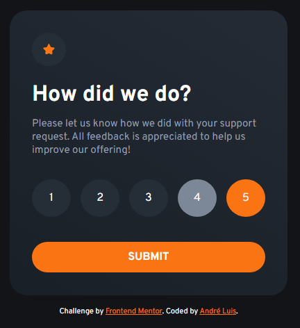
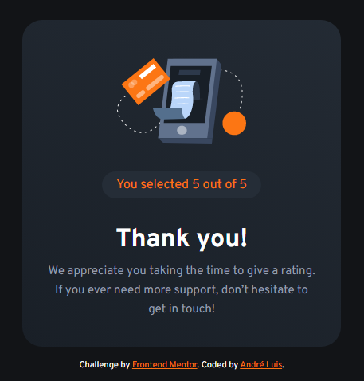

<h1 align="center"> Frontend Mentor - Interactive rating component solution </h1>

This is a solution to the [Interactive rating component challenge on Frontend Mentor](https://www.frontendmentor.io/challenges/interactive-rating-component-koxpeBUmI). Frontend Mentor challenges help you improve your coding skills by building realistic projects.

 

  <a href="#-tecnologias">Tecnologias</a>&nbsp;&nbsp;&nbsp;|&nbsp;&nbsp;&nbsp;
  <a href="#-projeto">Projeto</a>&nbsp;&nbsp;&nbsp;|&nbsp;&nbsp;&nbsp;
  <a href="#-screenshots">Screenshots</a>&nbsp;&nbsp;&nbsp;|&nbsp;&nbsp;&nbsp;
  <a href="#-links">Links</a>&nbsp;&nbsp;&nbsp;

 

## 🚀 Tecnologias

Esse projeto foi desenvolvido com as seguintes tecnologias:

- HTML, CSS e JavaScript

## 💻 Projeto

O desafio foi construir esse card de avaliações, no qual o usuário poderá escolher entre 1 e 5, enviar e receber uma mensagem de agradecimento. Para isso, foi utilizado JavaScript no envio do formulário e para mostrar os agradecimentos! Além do desafio cumprido, foi implementado animações em elementos, utilizando CSS, deixando o card mais bonito.

## 📸 Screenshots

  
  
  

## 🌎 Links

- Solution: [https://www.frontendmentor.io/solutions/interactive-rating-component-r2Y_YOvVGa](https://www.frontendmentor.io/solutions/interactive-rating-component-r2Y_YOvVGa)
- Live Site: [https://interactive-rating-aandreluis.netlify.app/](https://interactive-rating-aandreluis.netlify.app/)

---
